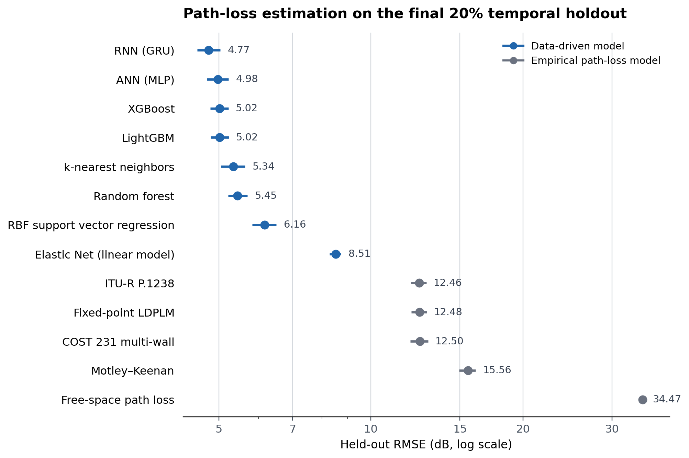

# Indoor LoRaWAN path loss modeling

**Temporally separated evaluation of analytical and empirical propagation models and machine learning regressors, with residual-tail calibration of fade margins.**

[](https://doi.org/10.5281/zenodo.15349730)
[](https://doi.org/10.1109/ACCESS.2025.3569164)
[](https://www.python.org/)

## Aim

This study compares analytical and empirical indoor propagation laws, linear models, tree ensembles, kernel methods, nearest-neighbour regression, and neural networks on a later period of LoRaWAN path loss measurements. It then uses out-of-fold errors to estimate fade margins at specified residual-coverage targets.

RMSE and the upper residual tail are distinct objectives. The RNN gives the lowest held-out RMSE, while the random forest has the lowest calibrated margin point estimate at a 99% residual-coverage target.

## Experimental design

The analysis uses 2,079,534 timestamped observations from six fixed indoor links collected over one year in an office environment at the University of Siegen. The predictors are distance, carrier frequency, concrete- and wood-wall counts, CO₂, relative humidity, PM2.5, pressure, temperature, and contemporaneous SNR; the response is path loss derived from received signal strength.

The evaluation protocol is deliberately chronological:

1. The earliest 80% of observations form the training period; the latest 20% are held out.
2. Hyperparameters are selected only within the training period using five expanding-window folds.
3. Out-of-fold residuals from those folds are used for residual-tail modelling and fade-margin calibration.
4. The untouched later period is used for final error and residual-coverage assessment.

This gives 1,663,627 training observations and 415,907 test observations. The training window spans 1 October 2024 to 12 August 2025; the test window continues to 30 September 2025. Where scaling is used, it is fitted within each fold. RNN sequences are constructed within device and fold boundaries.

The holdout tests temporal transfer within the same building and six links. Because SNR is measured from the same received packet as the response, the reported task is conditional post-reception estimation, not pre-transmission forecasting. It is also not evidence of generalisation to unseen buildings or link geometries.

Two training exceptions are explicit in the notebooks: ANN and RNN retain the latest training-period fold for early stopping, and exact SVR uses a temporally stratified 50% training subsample for computational tractability.

## Main result



*Held-out path loss error on the 415,883 rows common to all models. Points are RMSE; bars are 95% circular moving-block-bootstrap intervals (1,000 replicates; block length 5,000). Intervals quantify test-sampling uncertainty with fitted models held fixed.*

The RNN attained 4.77 dB RMSE (95% CI 4.54–5.04), compared with 4.98 dB for the ANN and 5.02 dB for both XGBoost and LightGBM. Paired bootstrap differences place the RNN ahead of the ANN by 0.205 dB (95% CI 0.162–0.247) and XGBoost by 0.242 dB (0.089–0.381); pairwise intervals among the ANN, XGBoost, and LightGBM include zero. The strongest empirical path loss models remain near 12.5 dB RMSE.

Point error and upper-tail margin requirements rank the models differently. At a 99% residual-coverage target, the lowest calibrated point estimate is from the random forest (17.74 dB; held-out residual coverage 99.62%), followed by XGBoost (17.85 dB), LightGBM (17.93 dB), ANN (18.01 dB), and RNN (18.36 dB). At the 98% and 99% targets, calibration takes the conservative maximum of the empirical and three-component Gaussian-mixture tail estimates; the 95% target uses the empirical quantile. Empirical-quantile intervals use device-aware moving blocks; Gaussian-mixture tail intervals are parametric.

## Model scope

| Class | Models |
|---|---|
| Propagation baselines | Free-space path loss, fixed-point LDPLM, Motley–Keenan, COST 231 multi-wall, ITU-R P.1238 |
| Linear | OLS, Ridge, Lasso, Elastic Net |
| Nonlinear classical ML | Random forest, XGBoost, LightGBM, k-nearest neighbours, RBF-SVR |
| Neural | Multilayer perceptron, GRU recurrent network |

Residual analyses test normality and tail shape, compare Gaussian-mixture representations, calibrate coverage-specific fade margins, inspect held-out margin exceedances, and use a paired block bootstrap for model comparisons.

## Reproduce the analysis

The reported model runs used Python 3.12. Download the current cleaned dataset and place it at the path expected by notebook `00`:

```bash
mkdir -p Data_Files
curl -L https://zenodo.org/api/records/19089760/files/3.cleaned_dataset_per_device.csv/content -o Data_Files/cleaned_dataset_per_device.csv
printf '%s  %s\n' 281a4f3c630d0fce9655fad1a7df3c33 Data_Files/cleaned_dataset_per_device.csv | md5sum --check
```

Create the main environment from [`requirements.txt`](requirements.txt):

```bash
python3.12 -m venv .venv
source .venv/bin/activate
python -m pip install --upgrade pip
python -m pip install -r requirements.txt
python -m ipykernel install --user --name lorawan-pathloss --display-name "Python (LoRaWAN path loss)"
jupyter lab
```

Notebook `06` requires a separate CUDA 12/RAPIDS environment. The versions used for the reported kNN run are recorded in [`requirements-rapids-cu12.txt`](requirements-rapids-cu12.txt):

```bash
python3.12 -m venv .venv-rapids
source .venv-rapids/bin/activate
python -m pip install --upgrade pip
python -m pip install -r requirements-rapids-cu12.txt
python -m ipykernel install --user --name lorawan-pathloss-rapids --display-name "Python (LoRaWAN path loss, RAPIDS)"
```

Select the RAPIDS kernel for `06_kNN.ipynb`; use the main kernel for the other notebooks.

Run the numbered notebooks from the repository root. Their order is the dependency graph:

| Stage | Notebook(s) | Output |
|---|---|---|
| Split and folds | [`00_Data_Preparation.ipynb`](00_Data_Preparation.ipynb) | Chronological train/test data and expanding-window indices |
| Baselines | [`01_Empirical_PLMs.ipynb`](01_Empirical_PLMs.ipynb), [`02_MLR.ipynb`](02_MLR.ipynb) | Empirical and linear-model fits and residuals |
| Nonlinear models | `03_RF.ipynb` through `09_RNN.ipynb` | Selected models and out-of-fold/test residuals |
| Residual tails | [`10_SHADOW FADING ANALYSIS.ipynb`](10_SHADOW%20FADING%20ANALYSIS.ipynb) | Distribution and Gaussian-mixture diagnostics |
| Margin calibration | [`11_FADE MARGIN ANALYSIS.ipynb`](11_FADE%20MARGIN%20ANALYSIS.ipynb) | Calibrated fade margins and held-out residual coverage |
| Synthesis | [`12_General_Comparisons.ipynb`](12_General_Comparisons.ipynb), [`13_Bootstrap_Model_Comparison.ipynb`](13_Bootstrap_Model_Comparison.ipynb) | Cross-model figures and paired uncertainty estimates |

The full benchmark is compute-intensive. XGBoost is configured for CUDA. ANN/RNN screening used a GPU, whereas multi-seed selection and final ensembles were run on deterministic CPU. The recorded SVR search alone required approximately 4.8 days with 12 parallel workers. Executed result cells document the reported runs, but generated search tables, data, models, residuals, and bulk analysis figures are intentionally excluded from version control and must be regenerated for a clean reproduction; the curated figure above is retained. Several notebook figures request Times New Roman and fall back to an installed font when it is unavailable.

## Data and citation

The current dataset version is archived on [Zenodo](https://doi.org/10.5281/zenodo.19089760) under CC BY 4.0. The concept DOI [`10.5281/zenodo.15349730`](https://doi.org/10.5281/zenodo.15349730) resolves to the latest release.

If you use the measurements, cite:

> N. Mokua Obiri and K. van Laerhoven, “A Comprehensive Data Description for LoRaWAN Path Loss Measurements in an Indoor Office Setting: Effects of Environmental Factors,” *IEEE Access*, vol. 13, pp. 83148–83170, 2025. https://doi.org/10.1109/ACCESS.2025.3569164

The dataset is CC BY 4.0. No separate licence has yet been declared for the analysis code.
