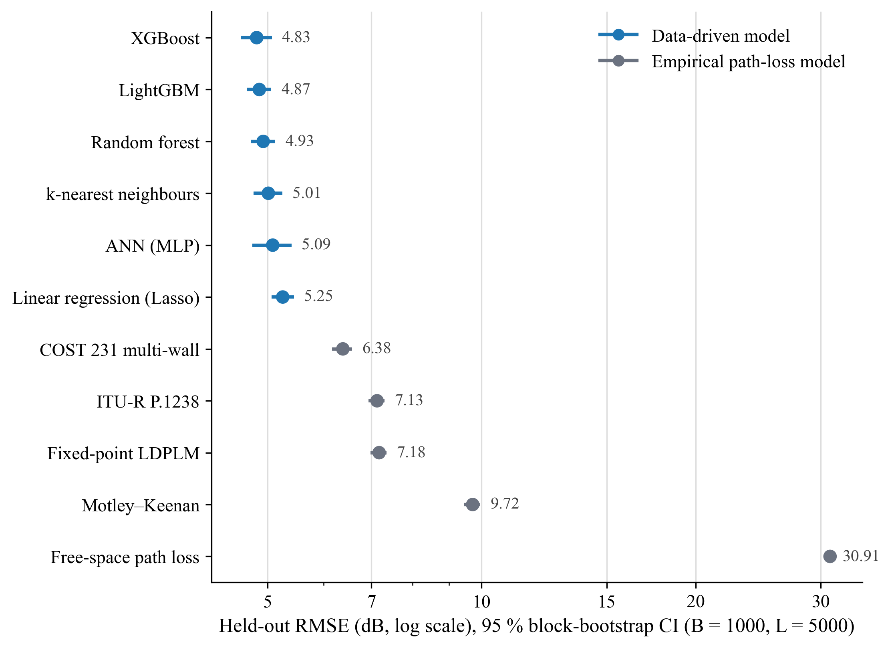
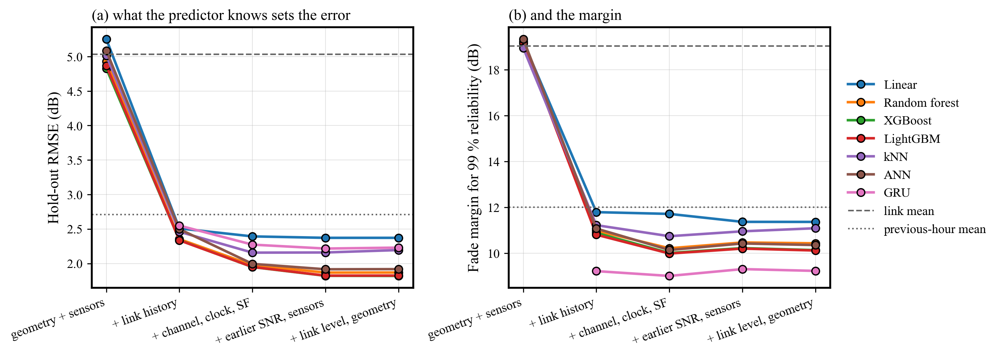
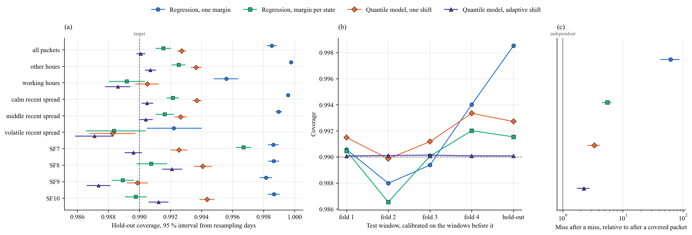
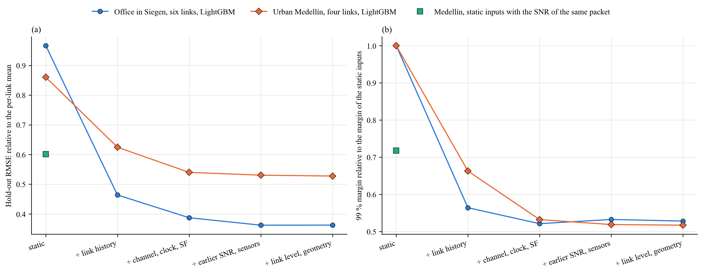

# Indoor LoRaWAN path loss modeling

**Temporally separated evaluation of analytical and empirical propagation models and machine learning regressors, with residual-tail calibration of fade margins as a function of what the predictor knows.**

[](https://doi.org/10.5281/zenodo.15349730)
[](https://doi.org/10.1109/ACCESS.2025.3569164)
[](https://www.python.org/)

## Aim

This study compares analytical and empirical indoor propagation laws, linear models, tree ensembles, nearest-neighbour regression and neural networks on a later period of LoRaWAN path loss measurements. It then uses out-of-fold errors to estimate fade margins at specified residual-coverage targets, and asks how those margins depend on what the predictor knows: geometry and environmental sensors only, or also the link's own earlier packets.

RMSE and the upper residual tail are distinct objectives. With geometry and sensors alone the 99% fade margin is 18.9 to 19.3 dB for every model, although held-out RMSE ranges from 4.8 to 6.4 dB. With the link's earlier packets it falls to 8.8 to 11.8 dB when calibrated on the whole year, which includes SF11 and SF12 rows that the hold-out lacks. A margin that also conditions on the spreading factor and the state of the link needs 4 to 5 dB on the hold-out. Notebooks 17 to 21 test the margins as quantile forecasts, compare the history models with the estimators of adaptive data rate schemes, measure what each group of inputs adds, repeat the ladder on a public dataset, and report the mean absolute error and the correlation within each link.

## Experimental design

The analysis uses 2,660,274 timestamped observations from six fixed indoor links collected from 1 October 2024 to 30 September 2025 in an office environment at the University of Siegen, at spreading factors 7 to 12. The static predictors are distance, carrier frequency, concrete- and wood-wall counts, CO₂, relative humidity, PM2.5, pressure and temperature; the response is path loss derived from the received signal strength at the project gateway. The SNR of the packet being predicted is not a predictor. The history rungs described below add inputs computed from the link's earlier packets only.

The evaluation protocol is deliberately chronological:

1. The earliest 80% of observations form the training period; the latest 20% are held out.
2. Hyperparameters are selected only within the training period, using five forward-chaining folds: each validation block is predicted by models trained on the blocks before it.
3. Out-of-fold residuals from those folds are used for residual-tail modelling and fade-margin calibration.
4. The untouched later period is used for final error and residual-coverage assessment.

This gives 2,128,219 training observations (1 October 2024 to 21 July 2025) and 532,055 test observations (21 July to 30 September 2025). The first block of 354,704 rows is only ever training data; the five following blocks of 354,703 rows give 1,773,515 out-of-fold residuals per model. Where scaling is used, it is fitted within each fold.

The end devices were restricted to spreading factors 7 to 10 in July 2025. The hold-out therefore contains SF11 or SF12 in only 33 of its rows, against 17 to 28% of the rows in the validation blocks, and margins calibrated on the validation blocks are conservative on it. The hold-out tests temporal transfer within the same building and six links; an unseen-link test fits on five links and predicts the sixth. Neither is evidence of generalisation to other buildings or link geometries.

Early stopping uses the latest part of each training set in time order: the latest training block for the ANN of notebook `07`, the latest 10% of the rows for the ANN and the GRU of the history notebooks.

## Main results

### Static models



*Held-out path loss error on the 532,055 rows common to all models. Points are RMSE; bars are 95% circular moving-block-bootstrap intervals (1,000 replicates; block length 5,000). Intervals quantify test-sampling uncertainty with fitted models held fixed.*

| Model | Out-of-fold RMSE | Held-out RMSE | Held-out R² | 95% margin | 99% margin |
|---|---|---|---|---|---|
| COST 231 multi-wall (calibrated) | 7.27 | 6.38 | 0.845 | 11.6 | 18.9 |
| Linear regression (Lasso) | 6.56 | 5.25 | 0.895 | 11.2 | 19.2 |
| Random forest | 6.32 | 4.93 | 0.907 | 11.0 | 19.2 |
| XGBoost | 6.36 | 4.83 | 0.911 | 11.3 | 19.2 |
| LightGBM | 6.34 | 4.87 | 0.910 | 10.7 | 19.2 |
| k-nearest neighbours | 6.68 | 5.01 | 0.904 | 11.3 | 18.9 |
| ANN (MLP) | 6.58 | 5.09 | 0.901 | 11.7 | 19.3 |

*RMSE in dB. Out-of-fold RMSE pools the 1,773,515 validation rows; R² is computed from the held-out residual files; margins in dB at the 95% and 99% residual-coverage targets.*

XGBoost leads at 4.83 dB (95% CI 4.59 to 5.07). The paired block bootstrap resolves it ahead of the random forest, kNN, the ANN and the linear model, by 0.10 to 0.42 dB, but not ahead of LightGBM; kNN, the ANN and the random forest are tied with one another. Every data-driven model beats the calibrated COST 231 multi-wall model by at least 1.1 dB and the fixed-parameter propagation models by at least 1.9 dB.

At a 99% residual-coverage target every static model needs 18.9 to 19.3 dB, at 98% 16.1 to 16.7 dB and at 95% 10.7 to 11.7 dB; the largest saving against the linear model at 99% is 0.29 dB. At the 98% and 99% targets calibration takes the conservative maximum of the empirical and three-component Gaussian-mixture tail estimates; the 95% target uses the empirical quantile. Held-out coverage at the 99% margin is 99.7 to 99.8%, and a fixed 10 dB margin reaches 96.0 to 98.2%. Empirical-quantile intervals use device-aware moving blocks; Gaussian-mixture tail intervals are parametric.

### Mean absolute error and correlation

Notebook 21 adds the mean absolute error and the Pearson correlation between measurement and prediction, on the 531,983 hold-out packets that every model predicts, with 95% intervals from resampling days. The correlation is given twice. Pooled over all links it is dominated by the 60 dB between the links; within each link, after removing the mean of the link from the measurement and from the prediction, it measures whether the model follows the variation of a link in time.

| Model | MAE, dB | RMSE, dB | Bias, dB | R² | Pearson r, all links | Pearson r, within link |
|---|---|---|---|---|---|---|
| COST 231 multi-wall (calibrated) | 5.09 [4.85, 5.34] | 6.38 | +1.49 | 0.845 | 0.924 [0.918, 0.931] | -0.11 [-0.12, -0.09] |
| Linear regression, static inputs | 4.15 [3.98, 4.33] | 5.25 | +1.46 | 0.895 | 0.951 [0.945, 0.956] | -0.10 [-0.18, -0.04] |
| Random forest, static inputs | 3.92 [3.75, 4.11] | 4.93 | +1.30 | 0.907 | 0.957 [0.951, 0.962] | -0.05 [-0.11, +0.00] |
| XGBoost, static inputs | 3.75 [3.56, 3.96] | 4.83 | +0.82 | 0.911 | 0.958 [0.952, 0.964] | -0.00 [-0.06, +0.05] |
| LightGBM, static inputs | 3.87 [3.70, 4.04] | 4.87 | +1.45 | 0.910 | 0.958 [0.953, 0.963] | +0.13 [+0.11, +0.14] |
| k-nearest neighbours, static inputs | 3.89 [3.69, 4.10] | 5.01 | +0.59 | 0.904 | 0.960 [0.954, 0.965] | +0.11 [+0.06, +0.17] |
| ANN, static inputs | 3.89 [3.63, 4.19] | 5.08 | -0.24 | 0.901 | 0.956 [0.948, 0.963] | -0.12 [-0.20, -0.04] |
| Per-link mean (no model) | 4.01 [3.84, 4.19] | 5.04 | +1.47 | 0.903 | 0.957 [0.951, 0.961] | constant per link |
| Previous-hour mean (no model) | 2.05 [2.01, 2.08] | 2.71 | +0.00 | 0.972 | 0.986 [0.985, 0.987] | +0.78 [+0.75, +0.81] |
| LightGBM, link history (rung 1) | 1.75 [1.73, 1.78] | 2.34 | +0.01 | 0.979 | 0.990 [0.989, 0.990] | +0.84 [+0.82, +0.86] |
| LightGBM, rung H4 | 1.43 [1.41, 1.45] | 1.95 | +0.00 | 0.986 | 0.993 [0.992, 0.993] | +0.89 [+0.88, +0.91] |
| LightGBM, rung H7 | 1.32 [1.30, 1.34] | 1.82 | +0.02 | 0.987 | 0.994 [0.993, 0.994] | +0.91 [+0.89, +0.92] |
| GRU, rung H4 | 1.45 [1.43, 1.47] | 1.97 | +0.07 | 0.985 | 0.993 [0.992, 0.993] | +0.89 [+0.88, +0.90] |

- **The pooled correlation separates nothing.** One constant per link scores 0.957 and every static machine-learning model between 0.951 and 0.960, so a model that knows only which link it is already sits above 0.95.
- **No static model follows a link in time.** The within-link correlation of the static models lies between -0.12 and +0.13, the history models reach 0.81 to 0.91, and the previous-hour mean alone 0.78.
- **The MAE ranks the static models like the RMSE does.** The machine-learning models lie between 3.75 and 4.15 dB, the per-link mean at 4.02 dB, and the history models between 1.3 and 1.9 dB. The static models are off by -0.2 to +1.5 dB on the summer hold-out and the history models by at most 0.17 dB.

### Link history



*Hold-out RMSE (left) and calibrated 99% fade margin (right) by information rung and model family. Dashed: each link's mean path loss; dotted: the previous-hour mean.*

From here the response is the deviation of path loss from the link's previous-hour mean, so the inputs are level-free and a model that learns nothing scores as the previous-hour mean. The rungs are cumulative: (1) the link's earlier path loss as lags and windows from five packets to seven days; (2) the history of the same channel, the clock and the spreading factor; (3) the SNR of earlier packets and the environmental sensors; (4) the link's level and its geometry. Every feature of a packet uses earlier packets of the same link only.

| Family | Geometry + sensors | + link history | + channel, clock, SF | + earlier SNR, sensors | + link level, geometry |
|---|---|---|---|---|---|
| Linear regression | 5.25 / 19.2 | 2.51 / 11.8 | 2.39 / 11.7 | 2.37 / 11.4 | 2.37 / 11.4 |
| Random forest | 4.93 / 19.2 | 2.35 / 11.0 | 1.98 / 10.2 | 1.87 / 10.5 | 1.87 / 10.4 |
| XGBoost | 4.83 / 19.2 | 2.34 / 10.9 | 1.95 / 10.0 | 1.82 / 10.2 | 1.82 / 10.1 |
| LightGBM | 4.87 / 19.2 | 2.34 / 10.8 | 1.95 / 10.0 | 1.82 / 10.2 | 1.82 / 10.1 |
| k-nearest neighbours | 5.01 / 18.9 | 2.46 / 11.2 | 2.16 / 10.7 | 2.16 / 11.0 | 2.19 / 11.1 |
| ANN (MLP) | 5.09 / 19.3 | 2.50 / 11.1 | 1.99 / 10.1 | 1.92 / 10.4 | 1.92 / 10.4 |
| GRU | not defined | 2.53 / 9.2 | 1.97 / 8.8 | 1.90 / 9.1 | 1.92 / 9.0 |

*Hold-out RMSE / 99% fade margin, both in dB. The first column is the static model of the table above. The GRU reads the last 30 packets of the link, with the windows that reach further back as static inputs, and is defined only where a history exists. Without a fitted model: link mean 5.04 dB / 19.0 dB; previous-hour mean 2.71 dB / 12.0 dB; previous packet 3.04 dB / 12.5 dB.*

Adding the link's earlier packets halves RMSE and brings the 99% margin from about 19 dB to between 8.8 and 11.8 dB in every family. The later rungs lower RMSE further, to 1.8 dB for the boosted trees, but change the margin by less than 1 dB: channel, clock, spreading factor, earlier SNR, sensors and geometry do not reduce the deep-fade tail. At the last rung the boosted trees, the random forest, the ANN and the GRU end between 1.82 and 1.92 dB; kNN and the linear model are 0.4 to 0.6 dB behind. The GRU reads the raw sequence of the last 30 packets, with spreading factor and channel as indicators; it matches the engineered windows and does not improve on them.

Fitted on five links and tested on the sixth (rung 2), the tree ensembles and the GRU reach 2.0 dB on average and 2.2 dB on the worst link, within 0.1 dB of the same models with the link in training; the ANN reaches 2.1 dB, kNN 2.3 dB and the linear model 2.4 dB. Coverage at the calibrated 99% margin is 99.7% on the unseen link (99.6% for the GRU).

### Calibrating and validating the margins

A margin is an upper quantile forecast, so it is tested like one. The shift added to a base predictor comes only from earlier packets, the score is the pinball loss, coverage is checked by state and not only overall, and the misses are tested for independence. Notebook 17 builds the margin on rung 2 with a LightGBM regression and with LightGBM quantile models, calibrates it five ways, and tests each on five windows: validation folds 1 to 4 and the hold-out, each calibrated on the folds before it. Hold-out, 99% target:

| Margin | Coverage | Lowest state coverage | Mean margin, dB | Pinball loss x 1000 | Miss clustering |
|---|---|---|---|---|---|
| Regression, one margin | 99.85% | 99.22% | 7.94 | 87.6 | 62.4 |
| Regression, margin per spreading factor and hours | 99.32% | 98.07% | 5.03 | 65.3 | 10.2 |
| Regression, margin per state, 36 cells | 99.15% | 98.81% | 4.73 | 63.0 | 5.5 |
| Regression, adaptive margin | 99.04% | 97.77% | 4.79 | 66.8 | 6.9 |
| Quantile model, one shift | 99.27% | 98.83% | 4.68 | 58.9 | 3.4 |
| Quantile model, shift per state | 99.15% | 98.90% | 4.57 | 58.4 | 2.8 |
| Quantile model, adaptive shift | 99.01% | 98.71% | 4.45 | 58.3 | 2.3 |

*Coverage is the share of hold-out packets below the margin. The lowest state coverage is over the working and other hours, the recent-spread terciles, the spreading factors and the links with 1,000 packets or more. Miss clustering is the chance of a miss right after a miss divided by the chance after a covered packet; 1 means independent misses. The margin per state is a lookup table of 36 shifts by spreading factor, working hours and recent-spread tercile.*



*Hold-out coverage by state with 95% intervals from resampling days (a), coverage in each test window (b) and the clustering of the misses on the hold-out (c), 99% target.*

- **A single pooled shift drifts with the regime.** One margin from all earlier validation packets covers between 98.8 and 99.4% in the four validation windows and 99.85% on the hold-out, which has no SF11 or SF12 and is a summer window. In the validation windows its worst state is always SF12, covered at 93.7 to 94.5%, while every other spreading factor is covered at 99.5% or more.
- **Knowing the state is most of the gain.** A margin per group of spreading factor and working hours cuts the pinball loss from 87.6 to 65.3 per thousand, and the table of 36 margins to 63.0. The mean margin above the anchor falls from 7.9 to 4.7 dB, at a hold-out coverage of 99.15% instead of 99.85%.
- **The quantile model is sharper than the table by about 6.5%.** Its pinball loss is 4.1 per thousand lower than that of the 36-cell table, with a 95% interval from 3.1 to 5.5. Its coverage in the volatile third is level with the table (difference 0.0 points, interval -0.2 to +0.1) and 0.8 points above the 12-cell table (interval +0.5 to +1.0). Conditional coverage therefore comes from knowing the state, by a table or by a model.
- **Adaptive conformal inference holds the target in every window.** Coverage is 99.0% in all five windows for both base predictors, where the pooled shift moves between 98.8 and 99.85%. In validation fold 3, the window with the heaviest tail, it lowers the pinball loss of the quantile model by 32%, with an interval from 8% to 66%.
- **Misses cluster less the more the margin knows.** The ratio is 62 for one regression margin and 2.3 for the quantile model with the adaptive shift, with an interval from 1.7 to 2.8, so no method reaches independence. A regression of the misses on the previous miss and the state rejects independence for every method with half a million packets, so the effect size matters: the chance of a miss across the states ranges from 0 to 15% with one regression margin and from 0.7 to 3.6% with the adaptive quantile margin, against a target of 1%.
- **The other targets.** At the 95 and 90% targets the ordering is the same. The adaptive quantile model reaches 95.0 and 90.0% coverage on the hold-out with a mean margin of 2.9 and 2.2 dB, where one regression margin gives 97.3 and 92.2% with 3.5 and 2.5 dB.

At one uplink every 10 minutes LightGBM on rung 2 reaches 2.3 dB RMSE and a 99% margin of 10.4 dB, against 2.7 dB and 11.9 dB for the mean of the previous 20 packets; at one uplink per hour it reaches 2.6 dB and 11.8 dB, against 3.2 dB and 13.1 dB.

### Estimators from the adaptive data rate literature

Notebook 18 puts the estimators of adaptive data rate schemes on the same footing as the learned history models: the previous packet, the mean, the median, the exponential average, a Kalman filter and the linear-regression extrapolation of the last 20 packets, and the best of the last 20 packets that the standard rule uses. The tuned ones are tuned on the validation folds. The margin is one shift per group of spreading factor and working hours, calibrated on the validation folds. Hold-out, 99% target, with the difference to the LightGBM in pinball loss and its 95% interval:

| Estimator of the current path loss | RMSE, dB | Coverage | Mean margin, dB | Pinball loss x 1000 | Difference to LightGBM |
|---|---|---|---|---|---|
| LightGBM on rung H4 | 1.95 | 99.3% | 5.03 | 65.3 |  |
| GRU on rung H4 | 1.97 | 99.3% | 4.95 | 65.6 | +0.3 [+0.0, +0.6] |
| exponential average, weight 0.1 | 2.62 | 99.4% | 5.69 | 70.9 | +5.5 [+5.1, +6.0] |
| Kalman filter, drift 0.01 | 2.63 | 99.4% | 5.69 | 71.0 | +5.6 [+5.2, +6.1] |
| mean of the last 20 | 2.63 | 99.5% | 5.93 | 72.6 | +7.3 [+6.9, +7.7] |
| median of the last 20 | 2.69 | 99.5% | 6.21 | 75.6 | +10.3 [+9.8, +10.9] |
| previous hour mean | 2.71 | 99.4% | 6.04 | 76.4 | +11.1 [+9.8, +12.4] |
| linear regression over the last 20 | 3.03 | 99.1% | 6.15 | 77.4 | +12.0 [+11.2, +12.9] |
| previous packet | 3.04 | 99.1% | 6.79 | 85.2 | +19.9 [+18.7, +21.0] |
| 24 hour mean | 3.29 | 99.3% | 8.87 | 111.4 | +46.0 [+38.2, +55.7] |
| best of the last 20 | 5.06 | 99.7% | 9.54 | 106.5 | +41.2 [+40.2, +42.3] |

- **The learned history models beat every classical estimator.** The exponential average and the Kalman filter reach 2.62 dB, level with the mean of the last 20 packets, 2.63 dB, and close to the previous-hour mean, 2.71 dB. The LightGBM reaches 1.95 dB and the GRU 1.97 dB. Filtering is not what matters: the learned models gain from the longer windows, the same-channel history, the clock and the spreading factor, which the classical estimators do not use.
- **The standard rule is the weakest.** The best of the last 20 packets selects the extreme and estimates the level with a 5.06 dB RMSE. A fixed 10 dB above it covers 96.7% at a 99% target; the same 10 dB above the mean of the last 20 packets covers 99.9%.

### What each group of inputs adds

Notebook 19 repeats the static benchmark with one LightGBM tuned separately on every subset of the nine inputs, and measures every step of the history rungs with paired intervals from resampling days. The static inputs, hold-out:

| Inputs | Hold-out RMSE, dB | Difference to the per-link mean |
|---|---|---|
| distance only | 4.95 | -0.09 [-0.13, -0.04] |
| geometry | 4.99 | -0.04 [-0.06, -0.03] |
| geometry + channel | 4.89 | -0.14 [-0.19, -0.10] |
| geometry + environment | 4.79 | -0.25 [-0.32, -0.18] |
| geometry + channel + environment (the benchmark) | 4.86 | -0.17 [-0.23, -0.11] |
| environment only | 15.74 | +10.70 [+10.23, +11.15] |
| per-link mean | 5.04 |  |
| global mean | 16.27 |  |

*The difference to the per-link mean is the hold-out RMSE minus that of the mean of each link over the earlier training packets, with a 95% interval. Distance alone takes six values for six links, so it is a per-link constant.*

- **Every subset with the geometry is within 0.25 dB of the per-link mean.** The whole range is as large as the noise of the tuning: repeating the search and the fits for the same inputs moves the hold-out RMSE by up to 0.12 dB. Distance alone, which is the per-link mean up to shrinkage, lands 0.09 dB below it, so differences of that size are not resolved.
- **The environment adds nothing resolvable.** The full model minus geometry and channel is -0.03 dB, with an interval from -0.07 to +0.02. The sensors alone remove 6.5% of the variance around one mean for all links, where the link identity removes 90%.
- **The link's history is the step.** It lowers the RMSE by 2.5 to 2.7 dB in every family. In the LightGBM the same-channel history gains a further 0.25 dB, the spreading factor 0.13 dB and the SNR of earlier packets 0.13 dB, while the clock, the sensors and the link level with the geometry add less than 0.01 dB each. All steps with their intervals are in `CV_Results/history_group_steps.csv`.

### The same ladder on an independent public dataset

Notebook 20 runs the same procedure on the public urban measurements of González-Palacio et al. ([data descriptor](https://doi.org/10.3390/data8010004)): four fixed end nodes in Medellín, 930,753 uplinks over six months, with the same chronological split and the same rungs, the sensors of that dataset in place of ours. LightGBM, hold-out:

| Inputs | Hold-out RMSE, dB | 99% margin, dB |
|---|---|---|
| per-link mean | 2.47 | 5.7 |
| previous hour mean | 1.62 | 3.9 |
| static inputs | 2.12 | 5.6 |
| static inputs + SNR of the same packet | 1.48 | 4.0 |
| rung H1 | 1.54 | 3.7 |
| rung H4 | 1.33 | 3.0 |
| rung H6 | 1.31 | 2.9 |
| rung H7 | 1.30 | 2.9 |



*Hold-out RMSE relative to the per-link mean (a) and 99% margin relative to the margin of the static inputs (b), for both datasets. The office margins are the pooled margins of notebook 16, the public ones the single shift of notebook 20.*

- **The ladder replicates.** The margin falls to 52 to 53% of the static margin from rung H4 on in both datasets, and the later rungs add little.
- **The SNR of the same packet buys what history buys.** Added to the static inputs it lowers the RMSE from 2.12 to 1.48 dB, close to the 1.54 dB of the link's own history. This is the gain of the published models, and it is leakage: the SNR of a packet is not known before the packet is received.
- **The refinements of the calibration matter less there.** The data hold one regime, spreading factors 7 to 10 throughout, and the quantile model lowers the pinball loss by 1 to 2%.

## Model scope

| Class | Models |
|---|---|
| Propagation baselines | Free-space path loss, fixed-point LDPLM, Motley–Keenan, COST 231 multi-wall (constant and wall losses calibrated by regression), ITU-R P.1238 |
| Linear | OLS, Ridge, Lasso, Elastic Net; the Lasso, selected by cross-validation, is the benchmark entry |
| Nonlinear classical ML | Random forest, XGBoost, LightGBM, k-nearest neighbours |
| Neural | Multilayer perceptron; GRU on the sequence of the link's earlier packets (history rungs only) |

Residual analyses test normality and tail shape, compare Gaussian-mixture representations, calibrate coverage-specific fade margins, inspect held-out margin exceedances, and use a paired block bootstrap for model comparisons.

## Reproduce the analysis

The reported model runs used Python 3.12. Download file 3 of the [Zenodo dataset, version 3](https://doi.org/10.5281/zenodo.23127026) and place it at the path expected by notebook `00`. The checksum is that of the file behind every result here:

```bash
mkdir -p Data_Files
curl -L https://zenodo.org/api/records/23127026/files/3.cleaned_dataset_per_device.csv/content -o Data_Files/cleaned_dataset_per_device.csv
printf '%s  %s\n' 2d69176011fb32e0ef5d664bf9285e98 Data_Files/cleaned_dataset_per_device.csv | md5sum --check
```

The file has 2,660,274 rows at spreading factors 7 to 12, with RSSI and SNR taken from the project gateway and pressure in hPa. The [data pipeline repository](https://github.com/nahshonmokua/LoRaWAN-Indoor-Path-Loss-Modelling-with-MultiWall-Environment-Factors) regenerates it from the raw export with notebooks 02 to 04.

Notebook `20` also reads the public urban measurements of González-Palacio et al., the file `LoRaWAN_PathLossMeasurements.csv` of the repository [magonzalezudem/MDPI_LoRaWAN_Dataset_With_Environmental_Variables](https://github.com/magonzalezudem/MDPI_LoRaWAN_Dataset_With_Environmental_Variables), which goes into `Data_Files`.

Create the main environment from [`requirements.txt`](requirements.txt):

```bash
python3.12 -m venv .venv
source .venv/bin/activate
python -m pip install --upgrade pip
python -m pip install -r requirements.txt
python -m ipykernel install --user --name lorawan-pathloss --display-name "Python (LoRaWAN path loss)"
jupyter lab
```

The GRU notebook trains on a GPU. Install TensorFlow with its CUDA libraries instead of the plain pin, for example `python -m pip install "tensorflow[and-cuda]==2.21.0"`.

Notebooks `06` and `14` require a separate CUDA 12/RAPIDS environment. The versions used for the reported kNN runs are recorded in [`requirements-rapids-cu12.txt`](requirements-rapids-cu12.txt):

```bash
python3.12 -m venv .venv-rapids
source .venv-rapids/bin/activate
python -m pip install --upgrade pip
python -m pip install -r requirements-rapids-cu12.txt
python -m ipykernel install --user --name lorawan-pathloss-rapids --display-name "Python (LoRaWAN path loss, RAPIDS)"
```

Select the RAPIDS kernel for `06_kNN.ipynb` and `14_History_kNN.ipynb`; use the main kernel for the other notebooks.

Run the numbered notebooks from the repository root. Their order is the dependency graph:

| Stage | Notebook(s) | Output |
|---|---|---|
| Split and folds | [`00_Data_Preparation.ipynb`](00_Data_Preparation.ipynb) | Chronological train/test data and forward-chaining fold indices |
| Baselines | [`01_Empirical_PLMs.ipynb`](01_Empirical_PLMs.ipynb), [`02_MLR.ipynb`](02_MLR.ipynb) | Empirical and linear-model fits and residuals |
| Nonlinear models | `03_RF.ipynb` through `07_ANN.ipynb` | Selected models and out-of-fold/test residuals |
| Residual tails | [`08_SHADOW FADING ANALYSIS.ipynb`](08_SHADOW%20FADING%20ANALYSIS.ipynb) | Distribution and Gaussian-mixture diagnostics |
| Margin calibration | [`09_FADE MARGIN ANALYSIS.ipynb`](09_FADE%20MARGIN%20ANALYSIS.ipynb) | Calibrated fade margins and held-out residual coverage |
| Synthesis | [`10_General_Comparisons.ipynb`](10_General_Comparisons.ipynb), [`11_Bootstrap_Model_Comparison.ipynb`](11_Bootstrap_Model_Comparison.ipynb) | Cross-model figures and paired uncertainty estimates |
| Link history | [`12_History_Features.ipynb`](12_History_Features.ipynb), [`history_features.py`](history_features.py) | Causal link-history inputs for the rungs |
| History models | `13_History_Models.ipynb` (linear, random forest, XGBoost, LightGBM, ANN), `14_History_kNN.ipynb`, `15_History_GRU.ipynb` | Residuals per family and rung, unseen-link test |
| Information tables | [`16_Information_by_Family.ipynb`](16_Information_by_Family.ipynb) | Rung by family tables and figure, quantile margins, sparse uplinks |
| Margin validation | [`17_Margin_Calibration.ipynb`](17_Margin_Calibration.ipynb), [`margin_tools.py`](margin_tools.py) | Calibrations on rolling origins, coverage by state, independence of the misses |
| Estimator baselines | [`18_ADR_Estimators.ipynb`](18_ADR_Estimators.ipynb) | The estimators of adaptive data rate schemes against the history models |
| Input groups | [`19_Feature_Groups.ipynb`](19_Feature_Groups.ipynb) | Ablation of the static inputs and the steps of the history rungs, with intervals |
| Public dataset | [`20_Medellin_Ladder.ipynb`](20_Medellin_Ladder.ipynb) | The ladder on the public urban measurements |
| Error metrics | [`21_Error_Metrics.ipynb`](21_Error_Metrics.ipynb) | MAE, bias and Pearson correlation, pooled and within link, for every model |

The full benchmark is compute-intensive. Approximate wall-clock times on a workstation with 32 CPU cores, 60 GB of RAM and one NVIDIA RTX 5090:

| Notebook | Time |
|---|---|
| `03_RF` | 5.2 h (Bayesian search, 60 candidates) |
| `04_XGBoost` | 8 min (CUDA) |
| `05_LightGBM` | 48 min |
| `06_kNN` | 13.7 h (400 candidates, RAPIDS GPU) |
| `07_ANN` | 4.0 h (CPU, deterministic operations; two-stage screen, 30-seed final ensemble) |
| `09_FADE MARGIN ANALYSIS` | 1.0 h |
| `12_History_Features` | 8 min |
| `13_History_Models` | 3.2 h |
| `14_History_kNN` | 20 min |
| `15_History_GRU` | 3.9 h (GPU) |
| `16_Information_by_Family` | 33 min |
| `17_Margin_Calibration` | 14 min |
| `18_ADR_Estimators` | 1 min |
| `19_Feature_Groups` | 12 min |
| `20_Medellin_Ladder` | 5 min |
| `21_Error_Metrics` | 30 s |

The other notebooks take minutes. Executed result cells document the reported runs, but generated search tables, data, models, residuals, and bulk analysis figures are intentionally excluded from version control and must be regenerated for a clean reproduction; the curated figures above are retained. Several notebook figures request Times New Roman and fall back to an installed font when it is unavailable.

## Data and citation

The dataset is archived on [Zenodo](https://doi.org/10.5281/zenodo.23127026) under CC BY 4.0. These notebooks use version 3 (October 2026), which corrects the RSSI and SNR attribution and the pressure unit of versions 1 and 2, as described in the version history of the record. The concept DOI [`10.5281/zenodo.15349730`](https://doi.org/10.5281/zenodo.15349730) resolves to the latest release.

If you use the measurements, cite:

> N. Mokua Obiri and K. van Laerhoven, “A Comprehensive Data Description for LoRaWAN Path Loss Measurements in an Indoor Office Setting: Effects of Environmental Factors,” *IEEE Access*, vol. 13, pp. 83148–83170, 2025. https://doi.org/10.1109/ACCESS.2025.3569164

The dataset is CC BY 4.0. No separate licence has yet been declared for the analysis code.
